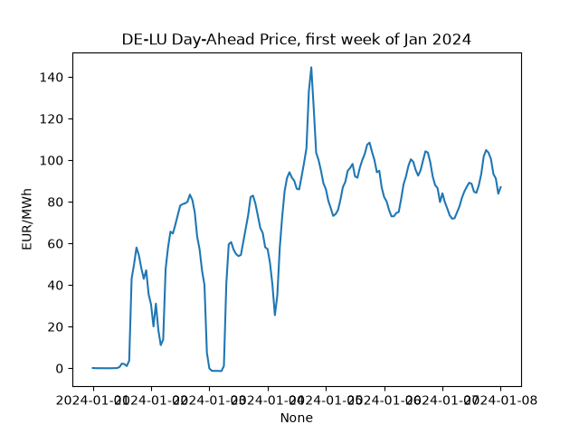
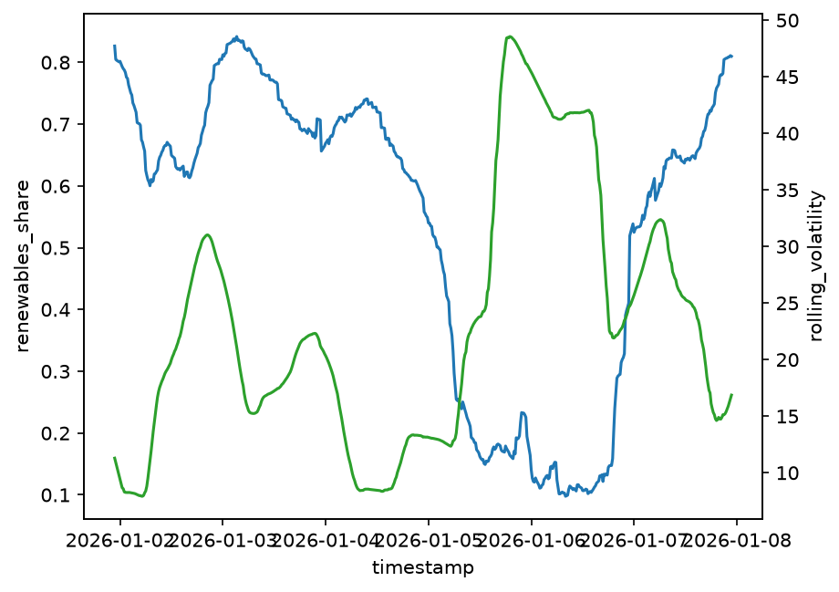

# Germany vs. Sweden: Energy Market Analysis (ENTSO-E)

How does variable renewable generation relate to electricity price volatility,
and how does the Baltic Cable interconnector shape price convergence between
Germany and southern Sweden?

This project pulls European electricity market data from the ENTSO-E
Transparency Platform, loads it into a SQLite database through a small ETL
pipeline, and runs two statistical analyses on it.

Full plan, rationale and methodology: [`docs/project-brief.md`](docs/project-brief.md).

## Questions

1. **Renewables and volatility:** does a higher share of variable renewables
   (wind + solar) go along with higher day-ahead price volatility, and does
   this differ between Germany (wind/solar-heavy) and Sweden (hydro/nuclear-heavy)?
2. **Transmission price pressure:** do German (DE-LU) and southern Swedish (SE4)
   prices decouple when the Baltic Cable between them is congested?

## Status

- **ETL pipeline:** working. It fetches day-ahead prices (DE-LU, SE1–SE4),
  generation by source (DE-LU, SE4) and cross-border flows (DE-LU ↔ SE4) at
  15-minute resolution, and upserts them into SQLite. Reruns are idempotent.
- **Next:** a full one-year pull, then both analyses.
- **Early finding (provisional, one sample week):** renewable share came out
  *negatively* correlated with price volatility in both zones, the opposite of
  the starting hypothesis. The full-year data will show whether this holds.


*DE-LU day-ahead prices over a sample week (15-min resolution).*


*SE4 24h rolling price volatility against variable renewable share, sample week.*

## Structure

```
src/                 ETL pipeline: ENTSO-E client, fetch → transform → load, shared helpers
analysis/            The two core analyses (read from the database, no API calls)
db/                  SQLite schema (the database file itself is not committed)
docs/                Project brief: rationale, methodology, decisions
outputs/figures/     Exported charts
```

## Quickstart

1. Get an ENTSO-E API key (register at transparency.entsoe.eu, then request
   API access by email; see brief Section 2) and put it in a `.env` file in the
   repo root:
   ```
   ENTSOE_API_KEY=your-token-here
   ```
2. Create a virtual environment and install dependencies:
   ```
   python -m venv .venv
   pip install -r requirements.txt
   ```
3. Run the pipeline from the repo root (creates `db/energy.db`):
   ```
   python -m src.pipeline
   ```

## Tech

Python · entsoe-py · pandas · SQLite + SQLAlchemy · statsmodels · seaborn/matplotlib · plotly

## Data

Data from the [ENTSO-E Transparency Platform](https://transparency.entsoe.eu),
licensed CC-BY 4.0. The data isn't committed to this repo. Run the pipeline
with your own API key to reproduce it.
