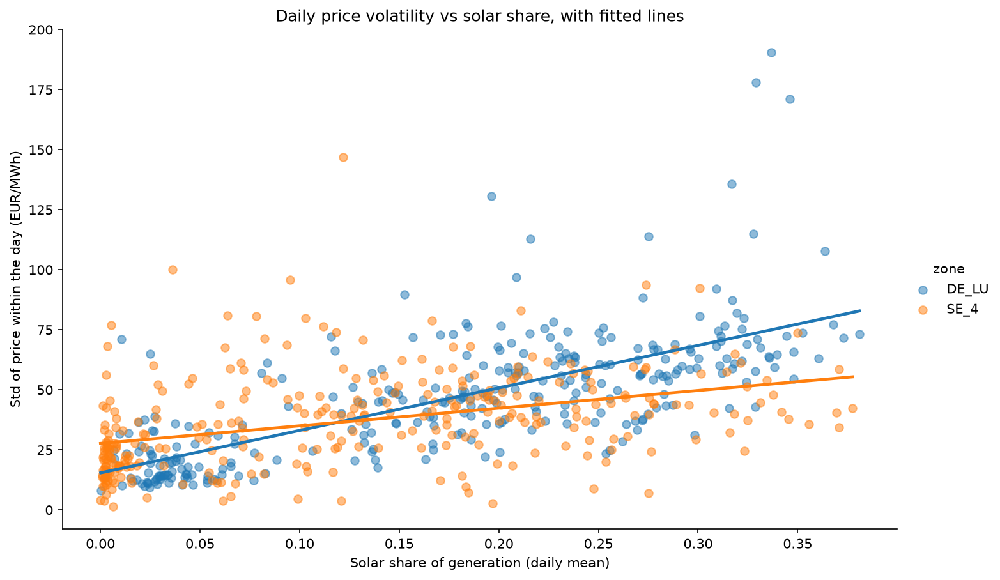
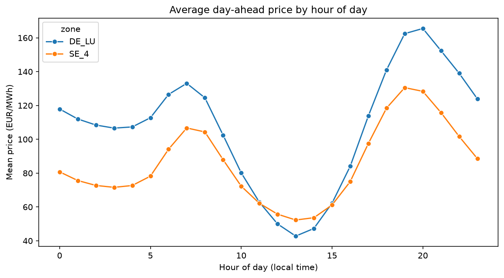

# Germany vs. Sweden: Energy Market Analysis (ENTSO-E)

How does variable renewable generation relate to electricity price volatility,
and how does the Baltic Cable interconnector shape price convergence between
Germany and southern Sweden?

This project pulls European electricity market data from the ENTSO-E
Transparency Platform, loads it into a SQLite database through a small ETL
pipeline, and runs two statistical analyses on it.

Full plan, rationale and methodology: [`docs/project-brief.md`](docs/project-brief.md).

## Questions

1. **Renewables and volatility:** does a higher share of variable renewables
   (wind + solar) go along with higher day-ahead price volatility, and is it different in Germany and Sweden?
   Answered below: it depends on which of the two, solar yes, wind no.
2. **Transmission price pressure:** do German (DE-LU) and southern Swedish (SE4)
   prices decouple when the Baltic Cable between them is congested? The hypothesis here is that the prices stay very close as long as the cable has spare capacity, and drift apart when it's full.

## Status

- **ETL pipeline:** working. It fetches day-ahead prices (DE-LU, SE1–SE4),
  generation by source (DE-LU, SE4) and cross-border flows (DE-LU ↔ SE4) at
  15-minute resolution, and upserts them into SQLite. Reruns are idempotent.
- **Data window:** a rolling year up to the latest complete day, but never
  earlier than 2025-12-02, the first date ENTSO-E publishes every series here
  at 15-minute resolution. The results below use 2025-12-02 to 2026-10-05,
  about ten months, with no November yet.
- **Analysis 1 (renewables and volatility):** done, see below.
- **Analysis 2 (the Baltic Cable and price convergence):** next.

## Findings: renewables and price volatility

Volatility here is the standard deviation of the 96 quarter-hourly prices
within a day. Shares are shares of the zone's own generation, averaged over
the day.

**Wind and solar have to be looked at separately.** Their combined share is
almost unrelated to volatility (Spearman +0.25 in DE-LU, −0.05 in SE4),
because the two pull in opposite directions.

- **Solar goes with larger price swings in Germany.** Spearman correlation
  +0.74. In a regression with HAC standard errors, 10 percentage points more
  solar goes with about 18 EUR/MWh more daily volatility (p < 0.001). The
  effect holds with month controls (about 23 EUR/MWh) and with
  log-transformed volatility, so it is neither a seasonal artefact nor driven
  by a few extreme days.
- **Wind shows no effect in Germany** once solar is accounted for (p = 0.86).
- **SE4 is different.** Its solar effect is a third the size of Germany's and
  disappears with month controls. SE4 generates little of its own power and imports much of what
  it uses, so local shares explain less there.
- **SE4 has the higher wind and solar share** (71% of local generation against
  47% in Germany) and the calmer prices, the opposite of the starting
  assumption that Germany is the wind-and-solar market of the two.
  They are however highly dependent on imports from other markets within Sweden
  demonstrating how interconnected the markets are.


*Each dot is one day. Lines are fitted on solar share alone, per zone.*


*The mechanism: prices dip at midday, when solar output peaks. German prices
average about 43 EUR/MWh at 13:00 against 166 EUR/MWh at 20:00. SE4 shows the
same dip with almost no solar of its own.*

These are associations in ten months of data, not proof of cause. Regression
tables and the underlying daily table are in `outputs/tables/`.

## Structure

```
src/                 ETL pipeline: ENTSO-E client, fetch → transform → load, shared helpers
analysis/            The two core analyses (read from the database, no API calls)
db/                  SQLite schema (the database file itself is not committed)
docs/                Project brief: rationale, methodology, decisions
outputs/figures/     Exported charts
outputs/tables/      Result tables: daily and hourly CSVs, correlations, regression summaries
```

## Quickstart

1. Get an ENTSO-E API key (register at transparency.entsoe.eu, then request
   API access by email; see brief Section 2) and put it in a `.env` file in the
   repo root:
   ```
   ENTSOE_API_KEY=your-token-here
   ```
2. Create a virtual environment and install dependencies:
   ```
   python -m venv .venv
   pip install -r requirements.txt
   ```
3. Run the pipeline from the repo root (creates `db/energy.db`):
   ```
   python -m src.pipeline
   ```
4. Run the analysis from the repo root (writes figures and tables to `outputs/`):
   ```
   python -m analysis.volatility_renewable_share
   ```

## Tech

Python · entsoe-py · pandas · SQLite + SQLAlchemy · statsmodels · seaborn/matplotlib · plotly

## Data

Data from the [ENTSO-E Transparency Platform](https://transparency.entsoe.eu),
licensed CC-BY 4.0. The data isn't committed to this repo. Run the pipeline
with your own API key to reproduce it.
